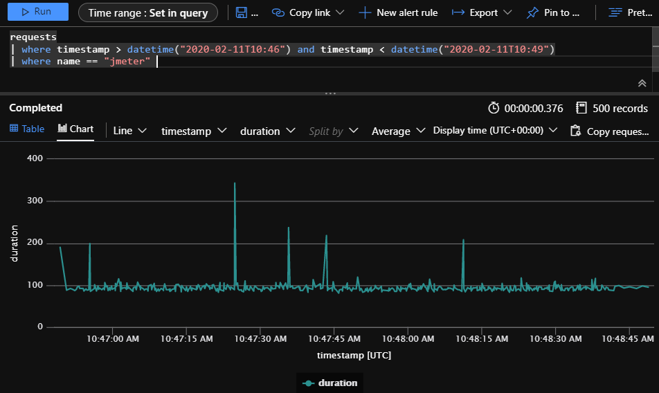

# jmeter-backend-azure


A JMeter plug-in that enables you to send test results to Azure Application Insights.

## Overview

### Description

JMeter Backend Azure is a JMeter plugin enabling you to send test results to an Azure Application Insights.  

The following test results metrics are exposed by the plugin.

- TestStartTime
- SampleStartTime
- SampleEndTime
- ResponseCode
- Duration
- URL
- SampleLabel
- SampleCount
- ErrorCount
- Bytes
- SentBytes
- ConnectTime
- IdleTime
- ThreadName
- GrpThreads
- AllThreads

### Plugin installation

Once you have built or downloaded the plugin JAR file from the [releases](https://github.com/adrianmo/jmeter-backend-azure/releases) section,
move the JAR to your `$JMETER_HOME/lib/ext`.

```bash
mv target/jmeter.backendlistener.azure-VERSION.jar $JMETER_HOME/lib/ext/
```

Then, restart JMeter and the plugin should be loaded.

### JMeter configuration

To make JMeter send test result metrics to Azure Application Insights, in your **Test Pan**, right click on 
**Thread Group** > Add > Listener > Backend Listener, and choose `io.github.adrianmo.jmeter.backendlistener.azure.AzureBackendClient` as `Backend Listener Implementation`. 
Then, specify the metric name and the Application Insights instrumentation key as a parameter as shown in image below.


### Visualization

Test result metrics are available in the **requests** dimension of your Application Insights instance. 
In the image you can see an example of how you can visualize the duration of the requests made during your test run.



## Contributing

Feel free to contribute by forking and making pull requests, or simply by suggesting ideas through the 
[Issues](https://github.com/adrianmo/jmeter-backend-azure/issues) section.

### Build

You can make changes to the plugin and build your own JAR file to test changes. To build the artifact, 
execute below Maven command. Make sure `JAVA_HOME` is set properly.

```bash
mvn clean package
```

---

This plugin is inspired in the [Elasticsearch](https://github.com/delirius325/jmeter-elasticsearch-backend-listener) and [Kafka](https://github.com/rahulsinghai/jmeter-backend-listener-kafka) backend listener plugins.